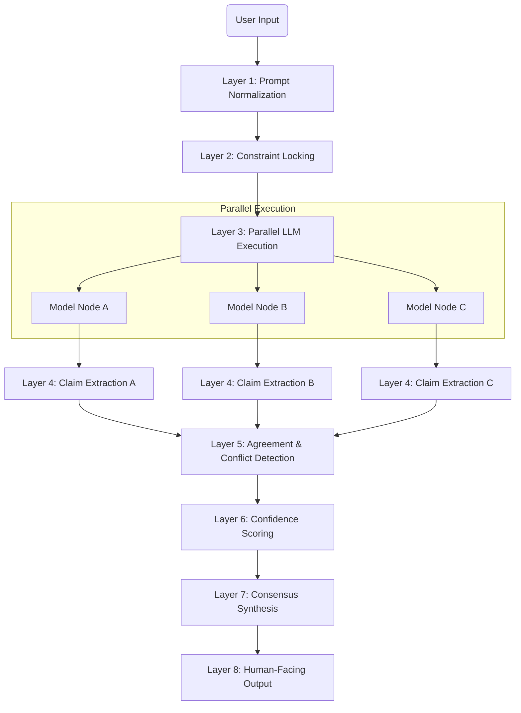

# VIBE-CODING CONSENSUS ENGINE — DESIGN SPECIFICATION

## 1. System Node Graph & Data Flow

The system simulates a directed acyclic graph (DAG) where data flows from user input to final consensus.



### Data Flow Description

1.  **Normalization (L1)**: Raw text -> `NormalizedPrompt` (JSON). Cleans intent and infers constraints.
2.  **Constraint Locking (L2)**: `NormalizedPrompt` -> `LockedContext`. Freezes constraints so they cannot be overridden.
3.  **Execution (L3)**: `LockedContext` -> List of `ModelResponse`. Queries independent models (or simulates them) in parallel.
4.  **Claim Extraction (L4)**: `ModelResponse` -> List of `AtomicClaim`. Breaks text into testable units.
5.  **Agreement (L5)**: List of `AtomicClaim` (from all models) -> `ClaimClusters`. Semantically groups claims and identifies conflicts.
6.  **Scoring (L6)**: `ClaimClusters` -> `ScoredClusters`. Assigns reliability scores based on support, conflicts, and constraint adherence.
7.  **Synthesis (L7)**: `ScoredClusters` -> `FinalConsensus`. Generates the final answer using only high-confidence claims.

## 2. Component Schemas

### Layer 1: Prompt Normalization
```json
{
  "intent": "string (e.g., build_app, explain_concept)",
  "domain": "string",
  "explicit_constraints": { "key": "value" },
  "inferred_constraints": { "key": "value" },
  "normalized_prompt": "string"
}
```

### Layer 2: Constraint Locking
```json
{
  "locked_constraints": { "key": "value" },
  "constraint_hash": "sha256_string"
}
```

### Layer 3: Model Output
```json
{
  "model_id": "string",
  "response_text": "string",
  "token_count": "number"
}
```

### Layer 4: Atomic Claims
```json
{
  "model_id": "string",
  "claims": [
    { "claim_id": "uuid", "text": "string" }
  ]
}
```

### Layer 5 & 6: Scored Clusters
```json
{
  "canonical_claim": "string",
  "supporting_models": ["model_id"],
  "conflicting_models": ["model_id"],
  "confidence_score": "number (0.0 - 1.0)",
  "reasons": ["string"]
}
```

### Layer 7: Final Output
```json
{
  "final_answer": "string",
  "confidence": "number",
  "uncertain_areas": ["string"]
}
```

## 3. Failure Modes & Mitigations

| Failure Mode | Detection | Mitigation |
| :--- | :--- | :--- |
| **Intent Ambiguity** | Layer 1 confidence < Threshold | Return "Clarification Required" payload immediately. |
| **Model Disagreement** | Layer 5 finds distinct clusters with equal support (polarity conflict) | Flag as "Disputed" in Consensus. Show side-by-side arguments. |
| **Constraint Violation** | Layer 6 detects claim contradicting `LockedContext` | Apply severe penalty score (set to 0). Exclude from final answer. |
| **Hallucination** | Layer 6 "Outlier" (only 1 model supports) | Low confidence score. Exclude from synthesis unless user requests "all possibilities". |
| **API Failure** | Layer 3 timeout/error | Retry node. If total failure, mark model as "Offline" and proceed with remaining models. |

## 4. Implementation Details

- **Backend**: Python 3.11+, FastAPI.
- **Graph Engine**: Custom `AntigravityEngine` class managing the flow.
- **LLM Interface**: Unified `ModelInterface` to call OpenAI/Gemini/Anthropic (or mocks for dev).
- **Semantics**: Simple embedding-based similarity (using sentence-transformers or API embeddings) for clustering.
